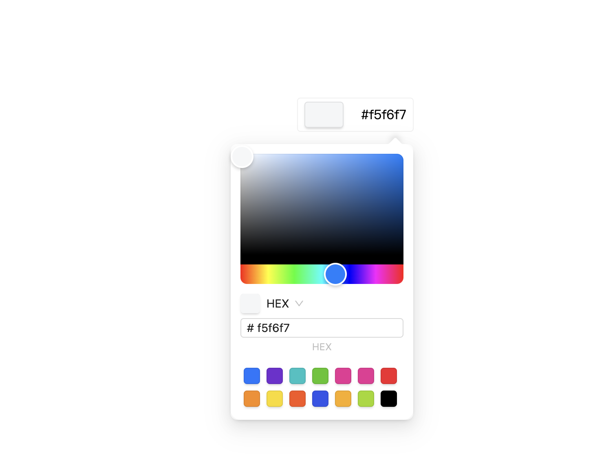

### ColorSelector
> This is a color selector because Vue ant design does not have a built-in color selector like React ant design, and no one was found in the color selector about the Vue technology stack. However, we can only refer to and extract the source code of Vue designing Vue, and then package it for our own use


- vue3-ColorSelector


| parameter | type | describe |
| --- | --- | --- |
| color | String | The value of the current color |
| handleChangeColor | Function | Method of manipulating colors |

-  Usage method

```vue
import { ref } from 'vue';
import {ColorSelector } from 'kingcwt-ui-color-selector'
import "kingcwt-ui-color-selector/es/style.css"

const color = ref('#f5f6f7')

const handleChangeColor = (str:string)=>{
  console.log(str,'color')
  color.value = str;
}


<template>
  <ColorSelector :color="color" :handleChangeColor="handleChangeColor"  />
</template>
```

- view
  
  

